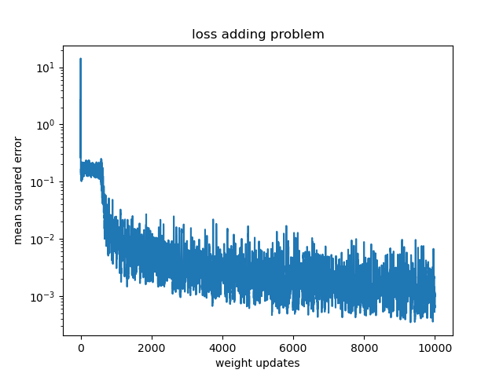

Train LSTM-, GRU- and Elman-RNN cells in NumPy
----------------------------------------------

Type i.e. ```python train_adding.py``` to train an LSTM cell to solve the adding problem in NumPy. It takes a while to converge,
as illustrated in the plot below.

Similarly ```python train_memory.py``` can be used to start training
on the memory problem. 

For both problems, GRUs can be trained by adding --cell_type
```python train_memory.py --cell_type GRU```.
For all possible arguments type 
```python train_memory.py -h```. 

On the Adding problem the model will take a while to converge
as illustrated below.


